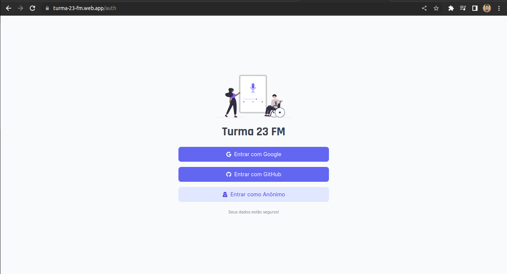
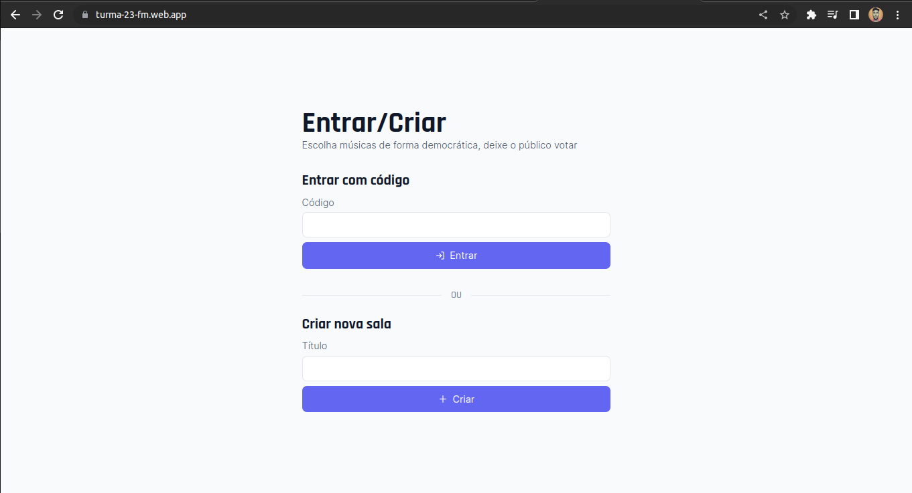
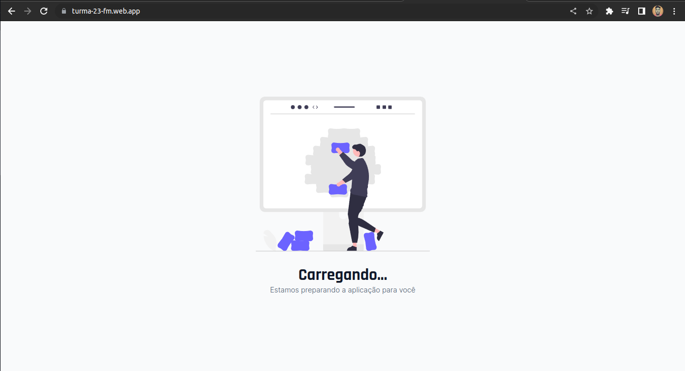

# Turma 23 FM

Um local para você compartilhar e votar naquelas músicas que você mais gosta!


<div align="center">
  
  
  
</div>

## :test_tube: Techs

Tecnologias e ferramentas que foram utilizadas para desenvolver este projeto:

- [ReactJS](https://reactjs.org/)
- [ViteJS](https://vitejs.dev/)
- [Vitest](https://vitest.dev/)
- [TypeScript](https://typescriptlang.org/)
- [TailwindCSS](https://tailwindcss.com/)
- [Firebase](https://firebase.google.com/)
- [GitHub Actions](https://github.com/features/actions)

## :books: Instalação

Passo a passo para rodar a aplicação no seu computador.

1. Clonar repositório:

```bash
git clone https://github.com/miguel5g/turma-23-fm.git
cd turma-23-fm
```

2. Instalar dependências:

```bash
npm install
```

3. Configurar variáveis de ambiente:

```bash
cp .env.example .env.local
```

_OBS: Preencher com suas variáveis de ambiente do firebase_

4. Executar projeto

```bash
npm run start:dev
```

## :sparkles: Contribuições

Contribuições são sempre bem-vindas!

Você pode contribuir de diversas formas, desde da sugestão de uma feature ou até mesmo mexendo no código.
